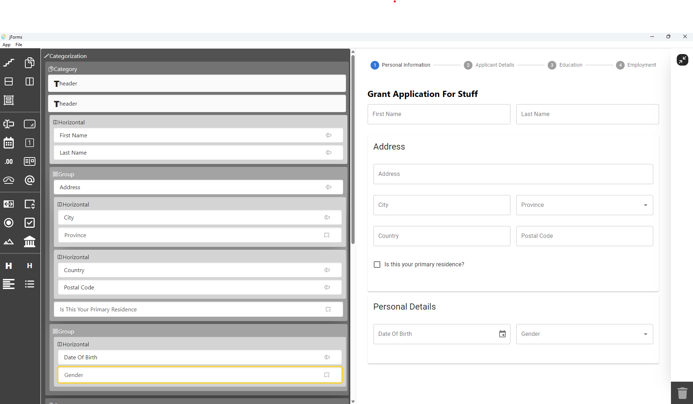

# jForms

---

# WARNING - This project is a work in progress and is in a pre-alpha state. It is not yet ready for production use.

This project is a drag and drop editor for JSON forms. It is based on the [JSON Forms](https://jsonforms.io/) library
and uses the [React](https://reactjs.org/) framework. The editor allows you to create and edit JSON forms by dragging
and dropping form elements.

The editor uses Tauri to create a desktop application from the React project. This allows the editor to be run as a
desktop application making file access easier.

## Installation



To install the project, you need to have both [node](https://nodejs.org/en/download/package-manager)
and [rust](https://www.rust-lang.org/tools/install) installed.
Once installed, clone the repository and run the
following commands:

```bash
npm install
```

## Running the project

To run the project, run the following command:

```bash
npm run dev
```
